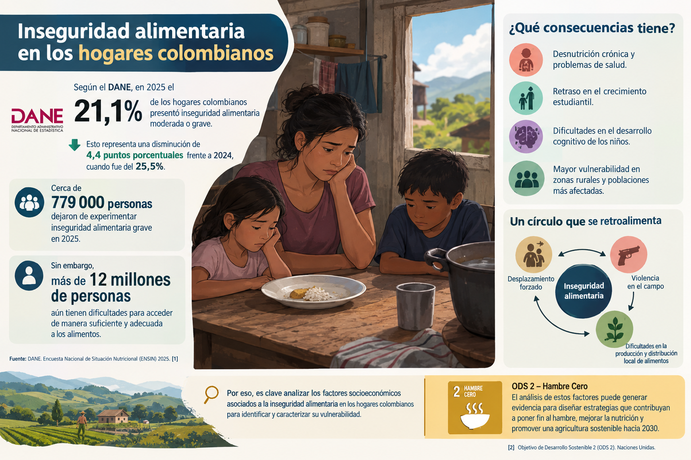
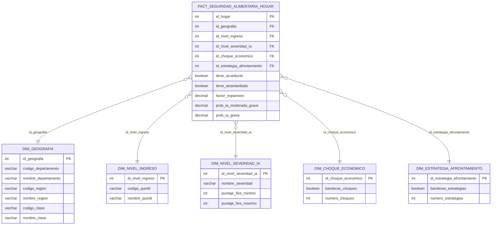

# Factores socioeconómicos asociados a la inseguridad alimentaria en los hogares colombianos

<p align="center">
  <strong>Proyecto académico de integración de datos, perfilamiento y diseño de un almacén de datos</strong><br>
  Encuesta Nacional de Calidad de Vida (ECV) 2025 · Colombia
</p>


## Índice

- [1. Contexto y problema](#1-contexto-y-problema)
- [2. Stakeholders](#2-stakeholders)
- [3. Alineación con los ODS](#3-alineación-con-los-ods)
- [4. Arquitectura propuesta](#4-arquitectura-propuesta)
- [5. ETL](#5-etl)
- [6. Modelamiento dimensional](#6-modelamiento-dimensional)
- [7. Consultas analíticas y KPIs](#7-consultas-analíticas-y-kpis)
- [8. Instrucciones de implementación](#8-instrucciones-de-implementación)
- [9. Tecnologías](#9-tecnologías)
- [10. Estructura del proyecto](#10-estructura-del-proyecto)
- [11. Dashboard](#11-dashboard)
- [12. Main findings, limitaciones y supuestos](#12-main-findings-limitaciones-y-supuestos)
- [13. Integrantes y responsabilidades](#13-integrantes-y-responsabilidades)

## 1. Contexto y problema




En Colombia, la **Encuesta Nacional de Calidad de Vida (ECV) 2025**, producida por el **Departamento Administrativo Nacional de Estadística (DANE)**, ofrece información socioeconómica y territorial a nivel de hogar. Esta fuente permite estudiar conjuntamente las condiciones de vida y las medidas de inseguridad alimentaria derivadas de la escala FIES, con una cobertura nacional y una unidad de observación adecuada para los requerimientos del proyecto.

El presente caso de estudio busca responder a la siguiente pregunta:

> **¿Qué factores socioeconómicos, territoriales y de condiciones de vida están asociados con una mayor prevalencia de inseguridad alimentaria en los hogares colombianos?**


## 2. Stakeholders

| Stakeholder | Interés en el problema | Uso potencial de los resultados |
|---|---|---|
| DANE | Producir, evaluar y divulgar estadísticas oficiales sobre condiciones de vida. | Contrastar resultados, fortalecer análisis estadísticos y orientar futuras mediciones. |
| Entidades nacionales de política social | Identificar población y territorios en situación de vulnerabilidad. | Priorizar programas de seguridad alimentaria, transferencias y atención social. |
| Gobernaciones y alcaldías | Comprender diferencias territoriales dentro de sus jurisdicciones. | Apoyar diagnósticos territoriales y focalizar intervenciones. |
| Organizaciones humanitarias y sociales | Reconocer hogares expuestos a inseguridad alimentaria y choques. | Orientar acciones de acompañamiento, prevención y respuesta. |
| Comunidad académica | Estudiar factores asociados a la inseguridad alimentaria. | Reproducir, ampliar y discutir los resultados con criterios metodológicos. |
| Ciudadanía | Conocer la magnitud y distribución de una problemática social. | Promover control social y comprensión de las brechas territoriales. |

## 4. Alineación con los ODS

| ODS | Relación con el proyecto | Contribución concreta |
|---|---|---|
| **ODS 2: Hambre Cero** | Es el objetivo principal, pues aborda la seguridad alimentaria, la nutrición y la identificación de hogares vulnerables. | Genera evidencia descriptiva sobre la prevalencia de inseguridad alimentaria y sus asociaciones con condiciones socioeconómicas. 


## 5. Arquitectura propuesta

La arquitectura prevista seguirá el flujo **fuentes crudas → extracción → limpieza y transformación → carga al almacén de datos → consultas analíticas → visualización**. La implementación definitiva se documentará cuando se completen las etapas de transformación y carga.

### Espacio reservado para el diagrama de arquitectura

> **Pendiente:** insertar aquí el diagrama de arquitectura del pipeline ETL, sus componentes, entradas, salidas y mecanismos de almacenamiento.

`[ Espacio reservado para imagen: diagrams/arquitectura_etl.png ]`

## 6. ETL

### 6.1 Extracción: fuente de datos

| Elemento | Descripción |
|---|---|
| Operación estadística | Encuesta Nacional de Calidad de Vida (ECV) 2025. |
| Productor y propietario | Departamento Administrativo Nacional de Estadística (DANE), Dirección de Metodología y Producción Estadística (DIMPE). |
| Catálogo | DANE-DIMPE-ECV-2025, catálogo 905. |
| Fuente oficial | [Portal de microdatos del DANE](https://microdatos.dane.gov.co/index.php/catalog/905/get-microdata). |
| Fuente del diccionario | [Diccionario de la tabla de condiciones de vida](https://microdatos.dane.gov.co/index.php/catalog/905/data-dictionary/F51?file_name=Condiciones%20de%20vida%20del%20hogar%20y%20tenencia%20de%20bienes). |
| Formato | CSV delimitado por punto y coma (`;`). |
| Codificación esperada | `utf-8-sig`. |
| Lectura | Todas las columnas se leen como texto (`dtype=str`) para conservar códigos con ceros a la izquierda. |
| Unidad de observación | Hogar, asociado a una vivienda. |

#### Archivos utilizados

| Archivo descargado | Nombre esperado en `data/raw/` | Nivel principal | Llave identificada |
|---|---|---|---|
| DBF-ECV-Datos_vivienda-2025 | `Datos de la vivienda.csv` | Vivienda | `DIRECTORIO` |
| DBF-ECV-Servicios_hogar-2025 | `Servicios del hogar.csv` | Hogar | (`DIRECTORIO`, `ORDEN`) |
| DBF-ECV-Condiciones_vida_hogar_tenencia_bienes-2025 | `Condiciones de vida del hogar y tenencia de bienes.csv` | Hogar | (`DIRECTORIO`, `ORDEN`) |

#### Adquisición y reproducibilidad

Los archivos crudos no se distribuyen en el repositorio debido a su tamaño y a las condiciones de descarga del portal. Para reproducir el pipeline, se deben descargar los tres archivos desde el catálogo oficial, conservar exactamente los nombres indicados y ubicarlos directamente en `data/raw/`. Las instrucciones completas se encuentran en [data/raw/README.md](data/raw/README.md).

### 6.2 Evaluación de idoneidad del conjunto de datos

| Criterio | Evaluación |
|---|---|
| Institución / propietario | DANE. Fuente oficial y pertinente para el contexto colombiano. |
| Acceso | Portal oficial de microdatos del DANE; requiere seguir sus condiciones de descarga. |
| Formato | Tres archivos CSV con separador `;`, codificación `utf-8-sig`. |
| Número de hogares integrados | 87.060 filas a nivel de hogar, después de las uniones. |
| Número de atributos | 286 columnas en la tabla integrada antes de la depuración. |
| Cobertura geográfica | Colombia; 9 regiones, 33 códigos departamentales y áreas de cabecera / centros poblados y rural disperso. |
| Cobertura temporal | ECV 2025; corresponde a una medición de corte transversal. |
| Medidas numéricas relevantes | `PROB_IAMG`, `PROB_IAG`, `PERCAPITA`, `I_HOGAR`, `FEX_C`, número de personas y conteos de choques o estrategias. |
| Atributos categóricos relevantes | Región, departamento, clase de área, acceso a acueducto y alcantarillado, choques y estrategias de afrontamiento. |
| Relación con R1-R5 | La fuente contiene variables suficientes para responder los cinco requerimientos definidos. |
| Idoneidad para modelamiento dimensional | Alta para un modelo a nivel de hogar, con dimensiones territoriales, de servicios, vulnerabilidad e ingreso por definir. |
| Unidad de observación | Un registro representa un hogar encuestado, relacionado con una vivienda mediante `DIRECTORIO`. |

### 6.3 Data profiling y evaluación de calidad

El perfilamiento se ejecutó sobre los archivos completos y se documentó en [notebooks/hallazgos_perfilamiento.md](notebooks/hallazgos_perfilamiento.md). Los resultados siguientes son hallazgos verificados, no supuestos.

#### Resumen estructural

| Aspecto evaluado | Resultado verificado | Implicación para el ETL |
|---|---|---|
| Registros | 87.060 hogares integrados. | El modelo debe conservar el nivel de hogar. |
| Columnas integradas | 286. | Se requiere seleccionar variables analíticas y retirar campos estructuralmente vacíos. |
| Llave de vivienda | `DIRECTORIO`: 86.848 filas, sin duplicados. | Puede relacionar hogares con su vivienda. |
| Llave de hogar | (`DIRECTORIO`, `ORDEN`): 87.060 filas, sin duplicados. | Es la llave compuesta operativa para servicios y condiciones de vida. |
| Integración | 87.060 filas antes y después de las uniones; cero pérdidas, duplicaciones o faltantes de correspondencia. | La integración propuesta es consistente. |
| Columnas 100% vacías | 21 columnas contenedoras. | Se descartan; no se interpretan como faltantes. |

#### Cobertura, dominios y calidad

| Dominio | Hallazgo | Tratamiento previsto |
|---|---|---|
| Territorio | `REGION`: 9 categorías; `P1_DEPARTAMENTO`: 33 códigos. En 6.365 filas faltan ceros a la izquierda. | Normalizar el departamento con `zfill(2)` y cruzar con DIVIPOLA. |
| DIVIPOLA | Los 33 códigos presentes en la ECV cruzan correctamente con la tabla de referencia. | Usar la referencia para obtener nombres y validar códigos. |
| Área | `CLASE`: 44.351 hogares en cabecera y 42.709 en centros poblados y rural disperso. | Conservar como dimensión o atributo de segmentación. |
| Servicios | Acueducto (`P8520S5`) y alcantarillado (`P8520S3`) usan 1/2 y no presentan nulos. | Decodificar y documentar las categorías. |
| Choques económicos | 12.935 hogares (14,9%) reportan al menos un choque; 74.125 (85,1%) no reportan choques. | Convertir baterías a indicadores o estructura analítica justificada. |
| Estrategias de afrontamiento | La ausencia de estrategias coincide exactamente con la ausencia de choques. | Validar consistencia y conservar la relación con R3 y R4. |
| Ingreso | `PERCAPITA` tiene 681 ceros; 3 son inconsistentes frente a `I_HOGAR` positivo. | Marcar los 3 casos y excluirlos únicamente de R5. |
| Valores extremos | Los 5 valores de `PERCAPITA` superiores a 50 millones cumplen la aritmética observada. | No eliminarlos automáticamente; documentar su tratamiento analítico. |
| FIES | `PROB_IAMG` y `PROB_IAG` son nulas en 718 hogares, coincidiendo con respuestas “no sabe/no informa”. | Excluir esos hogares de las prevalencias FIES y documentar el denominador. |


#### Consideraciones de interpretación

- En las baterías de selección múltiple, un vacío puede significar que la opción no fue marcada y no necesariamente un dato faltante.
- `P3202S12` representa “Ninguno de los anteriores”; no debe contarse como un choque económico.
- `P3203S10` (“Disminuyeron el gasto en alimentos”) requiere una interpretación diferenciada por su cercanía conceptual con la inseguridad alimentaria.
- El diccionario documenta directamente solo una parte de las variables núcleo. Para decodificar categorías se combinarán los dominios, las descripciones de variables y la tabla DIVIPOLA.

### 6.4 Limpieza

La limpieza se implementó en `src/clean.py` y se ejecuta antes de la transformación. Sus decisiones se basan directamente en los hallazgos del perfilamiento:

| Tabla | Operación aplicada | Justificación |
|---|---|---|
| Vivienda | Eliminación de `P8520`, `P4065`, `P5661` y `P3157`. | Son columnas contenedoras 100% vacías; la información se encuentra en sus subítems. |
| Vivienda | Normalización de `P1_DEPARTAMENTO` mediante `zfill(2)`. | Alinea los códigos con el estándar DIVIPOLA antes del cruce geográfico. |
| Servicios del hogar | Eliminación de `P1892`, `P5046S1`, `P5012`, `P3169`, `P3172` y `P3174`. | Son columnas contenedoras sin datos observados. |
| Servicios del hogar | Creación de `ingreso_percapita_inconsistente`. | Marca los 3 hogares con `PERCAPITA = 0` e `I_HOGAR > 0`, sin eliminar sus registros. |
| Condiciones de vida | Eliminación de `P9025`, `P3180`, `P9005`, `P784`, `P1072`, `P1077`, `P795`, `P1913`, `P3202`, `P3203` y `P3516`. | Son encabezados de baterías; los valores analíticos se encuentran en las variables hijas. |

#### Decisiones de limpieza

- Los vacíos de las baterías de selección múltiple no se imputan: representan que una opción no fue marcada.
- Los tres casos inconsistentes de ingreso se marcan para excluirlos únicamente del cálculo de quintiles; continúan disponibles para R1-R4.
- No se recalcula `PERCAPITA`, porque el perfilamiento no permite afirmar que el DANE lo obtenga mediante una división simple del ingreso del hogar.
- La limpieza no elimina hogares ni modifica las medidas FIES; prepara las tablas para que `transform.py` aplique las reglas de negocio.

### 6.5 Transformación

La transformación se implementó en `src/transform.py`. Integra las tres tablas, decodifica variables, deriva indicadores y conserva únicamente las columnas de negocio necesarias para los cinco requerimientos.

| Etapa | Decisión implementada | Resultado |
|---|---|---|
| Selección e integración | Se conservan únicamente las variables de vivienda, servicios, choques, estrategias, FIES y factores de expansión. | Una tabla integrada a nivel de hogar. |
| Llaves de integración | Condiciones y servicios por (`DIRECTORIO`, `ORDEN`); el resultado se une con vivienda por `DIRECTORIO`. | Se mantiene el grano de un hogar por fila. |
| Decodificación geográfica | Región y clase se obtienen del diccionario DANE; el departamento se obtiene de DIVIPOLA. | Se agregan `nombre_region`, `nombre_clase` y `nombre_departamento`. |
| Servicios públicos | `1` se transforma en `True` y `2` en `False` para acueducto y alcantarillado. | `tiene_acueducto` y `tiene_alcantarillado`. |
| Choques económicos | Se convierten 11 subítems en banderas booleanas; se excluye `P3202S12` porque representa “Ninguno de los anteriores”. | Indicadores `choque_*` para R3. |
| Estrategias de afrontamiento | Se convierten los 14 subítems en banderas booleanas. | Indicadores `estrategia_*` para R4. |
| Severidad FIES | Se calcula un puntaje crudo de 0 a 8 y se clasifica en seguridad, inseguridad leve, moderada, grave o sin dato. | `nivel_severidad_ia`. |
| Ingreso | Se calculan quintiles sobre la población expandida mediante `FEX_C`; los inconsistentes se clasifican aparte. | `quintil_ingreso`. |
| Medidas numéricas | Se convierten las cifras con coma decimal del DANE a valores numéricos. | `factor_expansion`, `prob_ia_moderada_grave` y `prob_ia_grave`. |
| Trazabilidad | Se conservan `DIRECTORIO` y `ORDEN` como llaves naturales. | Permite regresar al registro original del DANE. |

### 6.6 Carga

La carga se implementó en `src/load.py` para PostgreSQL. El proceso crea la base de datos si no existe, ejecuta el DDL, reinicia las tablas del modelo y carga las dimensiones antes del hecho.

| Decisión de carga | Implementación |
|---|---|
| Motor de destino | PostgreSQL mediante `psycopg2-binary`. |
| Definición física | `sql/create_tables.sql`. |
| Orden | `dim_geografia`, `dim_nivel_ingreso`, `dim_nivel_severidad_ia`, `dim_choque_economico`, `dim_estrategia_afrontamiento` y finalmente `fact_seguridad_alimentaria_hogar`. |
| Repetibilidad | Se ejecuta `TRUNCATE ... CASCADE` antes de una nueva carga completa. |
| Inserción | Carga por lotes con `execute_values`. |
| Nulos | Los valores nulos de pandas se convierten en `NULL` de PostgreSQL. |
| Consistencia | La carga se ejecuta dentro de una transacción; ante un error se revierten los cambios. |

## 7. Modelamiento dimensional

El modelo dimensional implementado corresponde a un esquema estrella. La especificación fuente se encuentra en [diagrams/star_schema.dbml](diagrams/star_schema.dbml) y su representación editable de dbdiagram.io en [diagrams/star_schema.dbdiagram](diagrams/star_schema.dbdiagram).

### 7.1 Requerimientos

| ID | Requerimiento |
|---|---|
| R1 | Caracterizar la distribución territorial de la inseguridad alimentaria. |
| R2 | Analizar la asociación entre el acceso a servicios públicos básicos de la vivienda y la vulnerabilidad alimentaria. |
| R3 | Analizar la relación entre los choques económicos recientes del hogar y su inseguridad alimentaria. |
| R4 | Caracterizar las estrategias de afrontamiento según la severidad de la inseguridad alimentaria. |
| R5 | Evaluar el gradiente de vulnerabilidad alimentaria según el nivel de ingreso del hogar. |


### 7.2 Declaración del grano

**Grano propuesto:** una fila de la tabla de hechos representa un hogar encuestado en la ECV 2025, identificado por (`DIRECTORIO`, `ORDEN`), asociado con una vivienda y con sus características territoriales, de servicios, choques, estrategias, ingreso y medidas de inseguridad alimentaria.

Este grano debe validarse antes de la carga para evitar duplicaciones, agregaciones indebidas o mezcla de niveles vivienda-hogar.

### 7.3 Dimensiones

| Dimensión | Grano | Propósito | Atributos principales | Tamaño observado | Clave sustituta |
|---|---|---|---|---|---|
| `dim_geografia` | Una combinación de departamento y clase de área. | Responder R1 y segmentar territorialmente el hogar. | Código y nombre de departamento, región y clase. | 65 filas | `id_geografia` |
| `dim_nivel_ingreso` | Un quintil de ingreso per cápita o la categoría de inconsistencia. | Responder R5 y ordenar el gradiente de ingreso. | `codigo_quintil`, `nombre_quintil`. | 6 filas | `id_nivel_ingreso` |
| `dim_nivel_severidad_ia` | Un nivel de severidad FIES. | Clasificar la situación alimentaria del hogar. | Nombre de severidad y límites del puntaje FIES. | 5 filas | `id_nivel_severidad_ia` |
| `dim_choque_economico` | Una combinación de choques económicos realmente observada. | Responder R3 sin crear combinaciones teóricas inexistentes. | 11 banderas booleanas y `numero_choques`. | 172 filas | `id_choque_economico` |
| `dim_estrategia_afrontamiento` | Una combinación de estrategias realmente observada. | Responder R4 y conservar la combinación de respuestas del hogar. | 14 banderas booleanas y `numero_estrategias`. | 265 filas | `id_estrategia_afrontamiento` |

Las dimensiones de choques y estrategias son **junk dimensions**: agrupan varias banderas de baja cardinalidad en una fila identificable por una clave sustituta. Solo se materializan combinaciones observadas en los datos, evitando el producto cartesiano completo.

### 7.4 Facts

| Tabla de hechos | Grano | Medidas | Claves foráneas | Llaves naturales conservadas |
|---|---|---|---|---|
| `fact_seguridad_alimentaria_hogar` | Una fila por hogar encuestado en la ECV 2025. | `factor_expansion`, `prob_ia_moderada_grave`, `prob_ia_grave`, `tiene_acueducto`, `tiene_alcantarillado`. | `id_geografia`, `id_nivel_ingreso`, `id_nivel_severidad_ia`, `id_choque_economico`, `id_estrategia_afrontamiento`. | `directorio`, `orden`; además `id_hogar` como clave sustituta del hecho. |

El hecho contiene 87.060 filas y 13 columnas. Las medidas de prevalencia deben calcularse ponderando por `factor_expansion`. Las probabilidades FIES pueden ser nulas únicamente para los 718 hogares clasificados como `Sin dato`.

### 7.5 Estrategia de claves sustitutas

| Elemento | Decisión de diseño | Justificación / evidencia |
|---|---|---|
| Generación | Claves enteras secuenciales desde 1, generadas al construir cada dimensión y el hecho. | Implementado en `dimensional_model.py` mediante `range(1, len(dim) + 1)`. |
| Dimensiones | Cada dimensión tiene una clave sustituta propia: `id_geografia`, `id_nivel_ingreso`, `id_nivel_severidad_ia`, `id_choque_economico` e `id_estrategia_afrontamiento`. | Permite que el hecho referencie categorías sin depender de códigos o combinaciones naturales. |
| Hecho | `id_hogar` identifica de forma única cada fila del hecho. | El validador comprueba que no existan duplicados. |
| Retención de llaves naturales | Se conservan `directorio` y `orden` en el hecho. | Mantienen trazabilidad al registro original y tienen una restricción `UNIQUE (directorio, orden)`. |
| Manejo de desconocidos | No se agrega una fila desconocida artificial. Los dominios y las relaciones deben quedar completos antes de la carga. | La validación verifica llaves no nulas y sin duplicados. |
| Integridad referencial | Todas las claves foráneas del hecho apuntan a sus dimensiones. | Está definido en `sql/create_tables.sql` y la carga respeta el orden dimensión → hecho. |
| Historización | No se implementa SCD en esta fase. | La ECV 2025 es transversal; se revisará si se incorporan nuevas rondas. |

### 7.6 Diagrama dimensional

El diagrama representa el hecho central y sus cinco dimensiones relacionadas mediante claves foráneas. La fuente editable está en [star_schema.dbml](diagrams/star_schema.dbml); el archivo [star_schema.dbdiagram](diagrams/star_schema.dbdiagram) conserva la distribución visual del esquema.




## 8. Consultas analíticas y KPIs

Las consultas analíticas se implementaron en `src/analytics.py` y se documentaron en [sql/analytical_queries.sql](sql/analytical_queries.sql). El módulo ejecuta una consulta para cada requerimiento R1-R5 sobre el modelo estrella ya cargado. Las prevalencias de inseguridad alimentaria se calculan de forma ponderada mediante `factor_expansion`, y se excluyen del denominador los hogares cuyo valor de `prob_ia_moderada_grave` es nulo.

| Requerimiento | Pregunta analítica | Dimensiones requeridas | Medidas / indicadores | KPI final |
|---|---|---|---|---|
| R1 | ¿Cómo se distribuye la inseguridad alimentaria por región y departamento? | `dim_geografia` | `hogares`, `factor_expansion`, `prob_ia_moderada_grave`, `prob_ia_grave` | Prevalencia ponderada de inseguridad moderada o grave y prevalencia ponderada de inseguridad grave por región y departamento. |
| R2 | ¿Qué relación se observa entre servicios públicos y vulnerabilidad alimentaria? | Ninguna dimensión adicional; utiliza atributos del hecho `tiene_acueducto` y `tiene_alcantarillado`. | `hogares`, `factor_expansion`, `prob_ia_moderada_grave`, `prob_ia_grave` | Prevalencia ponderada de inseguridad moderada o grave y grave según la combinación de acceso a acueducto y alcantarillado. |
| R3 | ¿Cómo se relacionan los choques económicos con la inseguridad alimentaria? | `dim_choque_economico` | `numero_choques`, `hogares`, `factor_expansion`, `prob_ia_moderada_grave`, `prob_ia_grave` | Prevalencia ponderada de inseguridad moderada o grave y grave según el número de choques económicos reportados. |
| R4 | ¿Qué estrategias de afrontamiento se observan según la severidad? | `dim_nivel_severidad_ia`, `dim_estrategia_afrontamiento` | `numero_estrategias`, `hogares`, `factor_expansion` | Distribución porcentual ponderada de hogares por nivel de severidad y número de estrategias de afrontamiento. |
| R5 | ¿Cómo cambia la vulnerabilidad alimentaria según el ingreso per cápita? | `dim_nivel_ingreso` | `hogares`, `factor_expansion`, `prob_ia_moderada_grave`, `prob_ia_grave` | Prevalencia ponderada de inseguridad moderada o grave y grave por quintil de ingreso. |

### Definición de las medidas

| Medida | Definición |
|---|---|
| `hogares` | Conteo de registros del hecho incluidos en cada agrupación. No representa por sí solo una estimación poblacional. |
| `factor_expansion` | Factor `FEX_C` utilizado para ponderar la muestra y aproximar la población nacional. |
| `prob_ia_moderada_grave` | Probabilidad FIES de inseguridad alimentaria moderada o grave, expresada en escala de 0 a 100. |
| `prob_ia_grave` | Probabilidad FIES de inseguridad alimentaria grave, expresada en escala de 0 a 100. |
| `numero_choques` | Conteo de choques económicos activos en la combinación de la dimensión junk. |
| `numero_estrategias` | Conteo de estrategias de afrontamiento activas en la combinación de la dimensión junk. |


## 9. Instrucciones de implementación

### Requisitos previos

1. Instalar Python 3.x.
2. Clonar o descargar este repositorio.
3. Crear y activar un entorno virtual.
4. Instalar las dependencias con:

```bash
pip install -r requirements.txt
```

5. Descargar los tres archivos de la ECV 2025 y ubicarlos en `data/raw/` con los nombres indicados.
6. Ejecutar el pipeline desde la raíz del proyecto:

```bash
python src/main.py
```

> **Estado actual:** `src/main.py`, la transformación completa, la carga y el modelamiento dimensional aún requieren implementación. El comando anterior queda como punto de entrada previsto para la ejecución integral.

## 10. Tecnologías

| Tecnología / paquete | Uso previsto |
|---|---|
| Python | Implementación del pipeline ETL y análisis. |
| pandas | Lectura, integración, limpieza y transformación de datos tabulares. |
| NumPy | Operaciones numéricas y derivación de indicadores. |
| SQLAlchemy | Conexión y operaciones con el almacén de datos. |
| psycopg2-binary | Conectividad con PostgreSQL. |
| python-dotenv | Gestión de variables de entorno. |
| Jupyter / IPython Kernel | Exploración y perfilamiento reproducible. |
| Matplotlib / Seaborn | Visualización exploratoria. |
| PyYAML | Lectura de configuraciones estructuradas. |
| openpyxl | Interoperabilidad con archivos de Excel. |

Las dependencias corresponden al contenido actual de [requirements.txt](requirements.txt).

## 11. Estructura del proyecto

```text
.
├── README.md                              # Documentación académica del proyecto
├── requirements.txt                       # Dependencias de Python
├── .env.example                           # Plantilla de variables de entorno
├── archify/
│   └── arquitectura-etl.json              # Fuente estructurada de la arquitectura ETL
├── dashboard/
│   └── .gitkeep                            # Espacio reservado para el dashboard final
├── data/
│   ├── raw/                                # Archivos originales descargados del DANE
│   │   ├── README.md                       # Instrucciones de adquisición y formato
│   │   ├── Datos de la vivienda.csv
│   │   ├── Servicios del hogar.csv
│   │   └── Condiciones de vida del hogar y tenencia de bienes.csv
│   ├── processed/
│   │   └── datos_transformados.csv         # Salida de la etapa de transformación
│   └── reference/                          # Fuentes auxiliares de decodificación
│       ├── Plantilla_Diccionario_Datos.csv
│       └── divipola_departamentos.csv
├── diagrams/
│   ├── contexto_problema.png               # Diagrama del contexto del problema
│   ├── star_schema.dbml                    # Definición editable del esquema estrella
│   ├── star_schema.dbdiagram               # Diseño visual del esquema estrella
│   └── diagrama-proceso-ETL/
│       ├── arquitectura-etl-inseguridad-alimentaria.html
│       ├── arquitectura-etl-inseguridad-alimentaria.visual-check.html
│       ├── arquitectura-etl-inseguridad-alimentaria.visual-check.json
│       └── *.png                           # Capturas de validación visual
├── notebooks/
│   ├── data_profiling.ipynb                # Exploración y perfilamiento
│   └── hallazgos_perfilamiento.md          # Hallazgos verificados
├── results/                                # Espacio para resultados exportados
├── sql/
│   ├── analytical_queries.sql              # Consultas analíticas R1-R5
│   └── create_tables.sql                   # DDL de dimensiones y hecho
└── src/
    ├── main.py                            # Orquestador del pipeline ETL y analítica
    ├── config.py                          # Configuración de conexión a PostgreSQL
    ├── extract.py                         # Extracción de archivos CSV
    ├── clean.py                           # Limpieza de tablas fuente
    ├── transform.py                       # Integración y derivación de variables
    ├── dimensional_model.py                # Construcción del esquema estrella
    ├── load.py                            # Creación y carga del almacén de datos
    ├── validate.py                        # Validación pre-carga y post-carga
    └── analytics.py                       # Ejecución de consultas R1-R5
```

## 12. Dashboard

El dashboard aún no ha sido construido. Esta sección se completará con la herramienta utilizada, las vistas implementadas, los filtros, los KPIs, la fecha de actualización y capturas de evidencia.

`[ Espacio reservado para descripción y capturas del dashboard ]`

#### Resultados de validación de inseguridad alimentaria

| Indicador | Resultado |
|---|---:|
| Prevalencia ponderada de inseguridad alimentaria moderada o grave | **21,10%** |
| Prevalencia ponderada de inseguridad alimentaria grave | **3,42%** |
| Método de ponderación | `SUM(FEX_C × PROB_IAMG) / SUM(FEX_C)` sobre hogares con dato válido. |
| Comparación externa | El 21,10% reconcilia con el 21,1% publicado oficialmente por el DANE para 2025. |


## 13. Integrantes y responsabilidades

| Integrante(s) | Responsabilidades |
|---|---|
| Santiago Castillo y Julián Aguilar | Modelamiento dimensional y desarrollo del código. |
| Valeria Jiménez Bedoya | Estructura de la documentación y contextualización del problema. |
| Danna Isabella Mosquera Mosquera | Modelado gráfico del dashboard. |

## Referencias

- [DANE. Catálogo de microdatos de la ECV 2025](https://microdatos.dane.gov.co/index.php/catalog/905/get-microdata)
- [DANE. Diccionario de datos: Condiciones de vida del hogar y tenencia de bienes](https://microdatos.dane.gov.co/index.php/catalog/905/data-dictionary/F51?file_name=Condiciones%20de%20vida%20del%20hogar%20y%20tenencia%20de%20bienes)
- [Naciones Unidas. Objetivo de Desarrollo Sostenible 2: Hambre Cero](https://www.un.org/sustainabledevelopment/es/hunger/)
- [Naciones Unidas en Colombia. Información sobre inseguridad alimentaria](https://colombia.un.org/es/316567-colombia-redujo-en-779-mil-personas-la-inseguridad-alimentaria-grave-en-2025)
